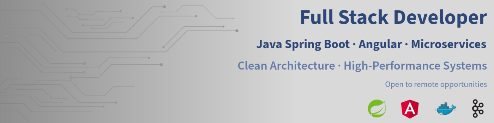

# Hi there, I am Manuel Cobos Solís
---

## 🌍 Find me around the web
- 🚀 **Personal Portfolio:** [manuelcobos-dev.vercel.app](https://manuelcobos-dev.vercel.app/)
- 💼 **LinkedIn:** [linkedin.com/in/manuelcobos](https://www.linkedin.com/in/manuelcobos)
- ✉️ **Email:** [manuelcobos200324@gmail.com](mailto:manuelcobos200324@gmail.com)

## 👨🏻‍💻 About Me

💼 **Full Stack Developer** at VIEWNEXT, building high-availability software for the banking and financial sector. Backend with **Java / Spring Boot**, frontend with **Angular**. I specialize in systems that have to work no matter what.

🎓 **Dual Graduate:** I hold degrees in both **Multiplatform Application Development (DAM)** and **Web Application Development (DAW)**, providing me with a comprehensive perspective on software engineering and modern web technologies.

🔑 I am highly proficient in the **Spring ecosystem** (Spring Boot, Spring Security, Spring Data) and **Clean Architecture**. I have solid experience building asynchronous messaging pipelines using **Apache Kafka** and real-time communication via **WebSockets**. My skill set includes container orchestration with **Docker** and **OpenShift**, automated CI/CD pipelines with **GitHub Actions**, Linux system administration (certified **LPIC-1**), and API development (certified **MuleSoft Certified Developer Level 1**).

## ⚙️ Professional Experience
- **VIEWNEXT | Banking Sector**: *Software Developer* (Jul 2025 - Present)
  - Development and maintenance of high-availability microservices with **Java** and **Spring Boot**.
  - Frontend development with **Angular** for internal tools and customer-facing interfaces.
  - Usage of **CI/CD** pipelines with **GitHub Actions** and **Docker** containers orchestrated on **OpenShift**.
- **VIEWNEXT | APIs & Streaming**: *Java Backend Developer* (Nov 2024 - Jun 2025)
  - Construction of an asynchronous messaging pipeline with **Apache Kafka** for processing financial events in real time.
  - Implementation of real-time communication with **WebSockets** for banking operation status notifications.
  - Development of REST controllers, data persistence (**Spring Data**) and security (**Spring Security**) under **Clean Architecture**.
- **VIEWNEXT | Enterprise Integration**: *Integration Developer* (Mar 2024 - Jun 2024)
  - Design of **MuleSoft Anypoint Platform** flows connecting legacy systems to modern APIs.
  - Data transformations and routing using **IBM Integration Bus (IIB)** for critical processes.

## 🎯 Technologies & Skills

